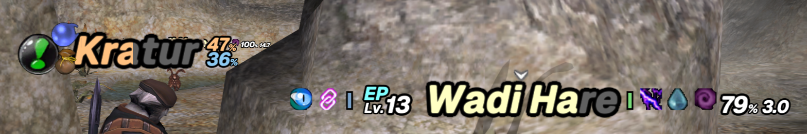
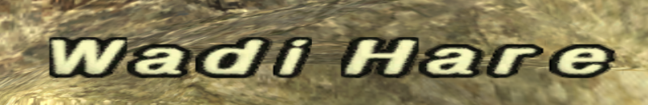
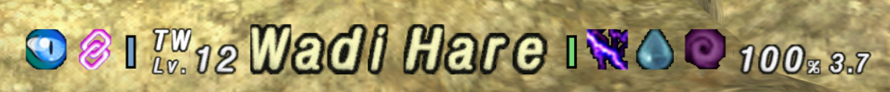
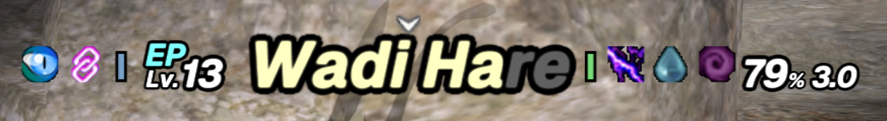
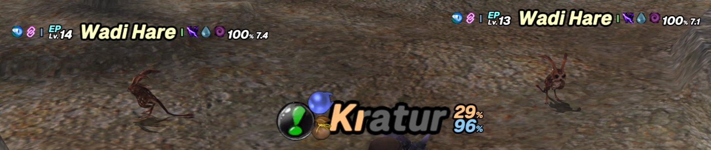
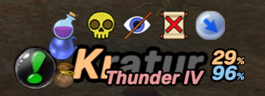
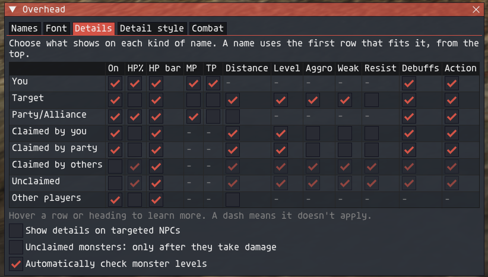

# Overhead

An Ashita v4 plugin that restyles Final Fantasy XI's overhead names and adds combat details to them: monster levels and check difficulty, HP, TP and MP, distance, aggro type, weaknesses and resistances, debuffs, and the action being readied or cast.

Names keep the game's own placement, colors and fading. You choose which details appear on your target, yourself, your party, and monsters depending on who's fighting them.



| Game's own name | With Overhead |
|---|---|
|  |  |

There's no server list. When it loads, the plugin finds the game code it needs in the running client, so it should work on any server that uses the standard FFXI client. It has been played on Phoenix and HorizonXI with Ashita 4.30. If it can't find the code it expects, for example on a modified client, it doesn't load and leaves the game untouched.

## Install

1. Download `overhead.dll` from the [latest release](../../releases/latest).
2. Put it in your Ashita `plugins` folder.
3. In game, run `/load overhead`. To load it every time, add `/load overhead` to your Ashita startup script (for example `scripts/default.txt`).
4. Run `/overhead` to open the settings window. Every option is set there, and hovering any option explains it.

Settings save to `config/overhead/settings.ini` in your Ashita folder.

## What it shows

**Names.** Letters are drawn in most fonts installed in Windows, with a black outline; the default is Tahoma Bold. You can also keep the game's own letters and still get all the details.

**Monster level and check.** The level appears beside the name, for example `Lv.45`, with the check result above it in its check color: `TW`, `EP`, `DC`, `EM`, `T`, `VT` or `IT`. Your target is checked quietly in the background, so nothing appears in chat, and your own `/check` still works as usual. Widescan also fills in levels, shown in white until a check adds the difficulty. Until a monster's level is known it shows `Lv.??`, and monsters that are impossible to gauge show `Lv.???` with a magenta `NM` tag.





**HP.** The name doubles as an HP bar: the part matching lost HP is dimmed. HP% can follow the name, turning light yellow below 75%, orange below 50% and red below 25%. Player names also change color below 75% HP.

**TP, MP and distance.** TP and MP appear as percentages (100% TP is 1000 TP), and distance in yalms. MP only appears for jobs that use MP.

**Aggro.** Icons for how a monster detects you: sight, true sight, sound, magic, job abilities, low HP (blood) and linking. A red strip means it attacks on its own and blue means it leaves you alone. These come from a monster database and show its usual habits, not what it's doing right now.

**Weaknesses and resistances.** Weapon types and elements that deal extra damage (green bar) or reduced damage, including immunities (red bar), from the same database.

**Debuffs.** A row of icons above the name, for monsters, yourself and your party. Your own and your party's debuffs come straight from the game. For monsters, the plugin tracks the debuffs it sees land and the messages that say they wore off. Durations are estimates based on each spell's base duration.

**Actions.** TP moves and spells being readied or cast appear under the name, then turn green if they worked or red if they missed, were resisted or were interrupted. Your party's and alliance's spells, weapon skills and abilities show too.



**Player icons.** The icons the game shows beside player names (seeking party, away, linkshell, bazaar, and others) were detached from the name, so the name stays centered under the cursor. By default, the linkshell and bazaar icons sit on the name's top-left and bottom-left corners, with an option to put restore the games default handling of the icons.

**Target helpers**, all off by default:
- **Enlarge far-away target** makes your target's name bigger when it's far away.
- **Hide the game's target window** hides the target box without needing another addon.  This also hides the target cursor, but Overhead replaces it.
- **Keep the arrow over your target** keeps the game's bouncing arrow when the target window is hidden.

**Damage numbers.** Resize them and fix widescreen stretch, separately from names. Off by default.

**Experience gained.** Experience, limit, capacity and exemplar points you earn float down from your name. Off by default.

## Settings window

- **Names**: restyle names (Off, Game font or Custom font), Size and Width, **Fix widescreen stretch**, target options and player icons.
- **Font** (custom font only): the font, italic, outline, edge softness and letter scaling. Press **Apply font** to use your changes.
- **Details**: a table of what shows on each kind of name. The rows are You, Target, Party/Alliance, monsters Claimed by you, Claimed by party, Claimed by others, and Unclaimed, plus Other players. A name uses the first row that fits it. Below the table are options for targeted NPCs, unclaimed monsters and automatic level checks.
  
- **Detail style**: a preview on your target and yourself, sizes for icons and action text, and which parts show through scenery.
- **Combat**: damage number size and points gained.

By default, your target shows everything. You and your party show HP%, TP, debuffs and actions. Monsters show level, aggro, debuffs and actions, with the HP bar on.

## Compatibility

- Not compatible with the original **Nameplate** plugin.

If something doesn't appear, `/overhead status` reports what the plugin is doing.

## Building from source

This needs Windows, Visual Studio 2022 with C++ tools and the Windows SDK, CMake and Python 3. Build as Win32.

```powershell
.\prepare-sdk.ps1
python -m venv .venv
.\.venv\Scripts\python -m pip install capstone==5.0.7 pefile==2024.8.26
.\.venv\Scripts\python tools/prepare_profile.py 'C:\Path\To\FINAL FANTASY XI\FFXiMain.dll'
.\build.ps1
```

The build writes `build/Release/overhead.dll`. `prepare-sdk.ps1` downloads the Ashita SDK headers pinned to commit `4171c74c8ddb2ca2a31654f199e6c1cee40d7256`. `prepare_profile.py` reads your own `FFXiMain.dll` without running or changing it, and generates local build inputs. The build step accepts only the client versions listed in the script. The DLL it produces isn't tied to that version: at load time it finds the game code it needs in whatever client is running.

The monster data in `src/trait_data.inc` and `src/trait_atlas.inc` is already generated. To regenerate it, run `tools/prepare_traits.py` on a MobDB checkout (needs Pillow).

## Credits

Monster aggro, weakness and resistance data and seven aggro icons come from [ThornyFFXI/MobDB](https://github.com/ThornyFFXI/mobdb/tree/eee7e1ad5d0a49eb667f1f88602d9fce76276330) under the [MIT license](licenses/MobDB.txt). The DLL also embeds that license notice.

## License

Overhead is released under the [MIT license](LICENSE).
